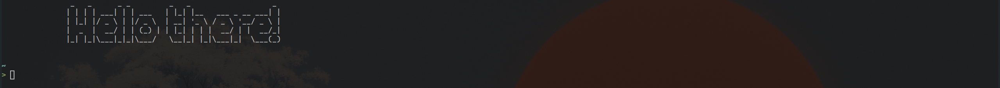

# English/Inglés
## About me
I am Nykenik24, a hobby programmer, and I make:
- Lua libraries.
- Games.
- Small apps in languages like Go, JavaScript/TypeScript, C/C++, etc.
- Low-level stuff *(most made in C)*.

I am a native Spanish speaker, so expect a whole lot of typos or structural errors.

## Tools I use
- **OS & Desktop**: Fedora Linux 41 with KDE Plasma.
- **Text editor**: NeoVim with AstroVim.
- **Languages**:
  - Lua
  - C ***(love it)***
  - C++ ***(love it, but less than pure C)***
  - Go
  - JavaScript
  - TypeScript
## Links
- Website: [nykenik24.github.io](https://nykenik24.github.io/)
- YouTube channel: [@Nykenik24](https://youtube.com/@nykenik24)

<h1>Spanish/Español</h1>

  
## Sobre mi
Soy Nykenik, y programo como hobby:
- Librerias de Lua.
- Juegos.
- Aplicaciones pequeñas en Go, JavaScript/TypeScript, C/C++, etc.
- Algunas cosas low-level *(la mayoria hechas en C)*.

## Herramientas que uso
- **SO & Escritorio**: Fedora Linux 41 con KDE Plasma.
- **Editor de texto**: NeoVim con AstroVim.
- **Lenguajes**:
  - Lua
  - C ***(me encanta)***
  - C++ ***(me encanta, pero menos que C puro)***
  - Go
  - JavaScript
  - TypeScript

## Enlaces
- Página web: [nykenik24.github.io](https://nykenik24.github.io/)
- Canal de YouTube: [@Nykenik24](https://youtube.com/@nykenik24)

